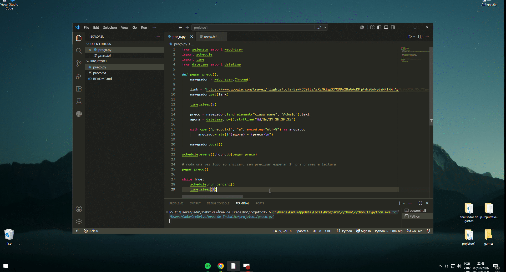

# ✈️ Monitor de Preço de Passagens Aéreas

Automação em Python que verifica periodicamente o preço de uma passagem aérea no Google Flights e registra o histórico de preços com data e hora em um arquivo de texto.

## 🎥 Demonstração

<p align="center">
  
</p>

## 📋 O que o projeto faz

- Abre o Google Flights com uma busca de voo pré-definida usando **Selenium**.
- Extrai o menor preço disponível na página.
- Salva o preço junto com a data/hora da consulta em `preco.txt`, criando um histórico ao longo do tempo.
- Repete essa verificação automaticamente em intervalos definidos (por padrão, a cada hora), usando a biblioteca **schedule**.

Exemplo de saída no `preco.txt`:
```
02/07/2026 14:00:03 - a partir de R$ 7.248
02/07/2026 15:00:05 - a partir de R$ 7.190
```

## 🛠️ Tecnologias usadas

- [Python](https://www.python.org/)
- [Selenium](https://www.selenium.dev/) — automação do navegador
- [schedule](https://schedule.readthedocs.io/) — agendamento de tarefas recorrentes

## ▶️ Como rodar

1. Clone o repositório:
   ```bash
   git clone https://github.com/Kadyon7/monitor-preco-passagens.git
   cd monitor-preco-passagens
   ```

2. Instale as dependências:
   ```bash
   pip install selenium schedule
   ```

3. Baixe o [ChromeDriver](https://chromedriver.chromium.org/downloads) compatível com a sua versão do Google Chrome e garanta que ele esteja acessível no PATH do sistema.

4. Execute o script:
   ```bash
   python agendador_preco.py
   ```

O script roda uma vez imediatamente ao iniciar e, depois, a cada hora, abrindo o navegador para consultar o preço atual.

> ⚠️ O navegador abre visivelmente durante a execução — o script não usa modo headless, então uma janela do Chrome vai aparecer na tela a cada consulta.

## 🔧 Configurações

Para alterar o intervalo de verificação, edite esta linha no código:
```python
schedule.every().hour.do(pegar_preco)
```

Para alterar o voo/rota monitorado, troque a variável `link` pela URL de busca desejada do Google Flights.

## 🚀 Possíveis melhorias futuras

- [ ] Rodar em modo headless (sem abrir janela do navegador)
- [ ] Enviar alerta por e-mail/WhatsApp quando o preço cair abaixo de um valor definido
- [ ] Gerar gráfico de variação de preço ao longo do tempo
- [ ] Hospedar em nuvem para rodar 24/7 sem depender do computador ligado
- [ ] Suportar monitoramento de múltiplas rotas simultaneamente

## 📄 Licença

Este projeto é livre para uso e estudo.
